<p align="center">
  <picture>
    <source media="(prefers-color-scheme: dark)" srcset="docs/images/banner-dark.svg">
    
  </picture>
</p>

<p align="center">
  <a href="#see-it-teach">See it teach</a> ·
  <a href="#the-method">The method</a> ·
  <a href="#learn-anything">Learn anything</a> ·
  <a href="#around-the-lessons">Around the lessons</a> ·
  <a href="#quick-start">Quick start</a> ·
  <a href="#how-it-works">How it works</a>
</p>

<p align="center">
  
  
  
  
  
</p>

---

**Aristotle is a personal tutor that lives on your machine.** An AI agent does the teaching, [Claude Code](https://claude.com/claude-code) unless you pick another; Aristotle is the room you learn in. Lessons come one reasoning step at a time, each followed by a question you answer yourself, and they are drawn, animated and explorable rather than walls of text. A living map shows what you understand, spaced review catches what is fading, training sets get harder as you do, and missions take what you learned out into your own life.

It runs on your Claude subscription, with no API keys. Or let Codex, Gemini CLI or opencode teach, or any model behind an OpenAI-compatible API: OpenAI, OpenRouter, or one on your own machine with Ollama, LM Studio or llama.cpp. No accounts, no cloud: everything you learn is a plain file you own.

<p align="center">
  <a href="docs/images/hero-dark.webp"><picture><source media="(prefers-color-scheme: dark)" srcset="docs/images/hero-dark.webp">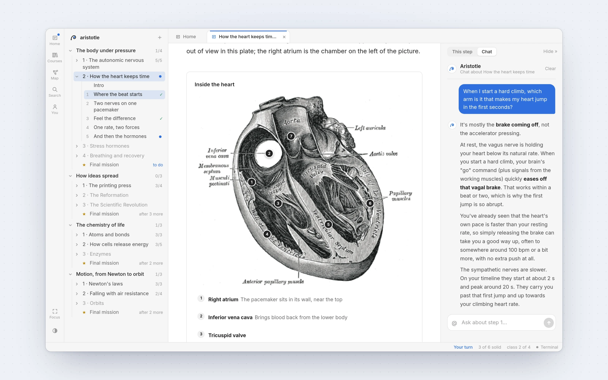</picture></a>
</p>

## See it teach

A real stretch of a lesson, start to finish. A quiz whose wrong options are mistakes you would really make: you pick one, the explanation tells you why, and your map marks the idea shaky. The next step arrives with a diagram that plays out the answer. Then an open question you answer in your own words; Claude reads what you wrote, says what you got right, and the idea goes back to solid.

<p align="center">
  <picture><source media="(prefers-color-scheme: dark)" srcset="docs/images/lesson-loop-dark.webp">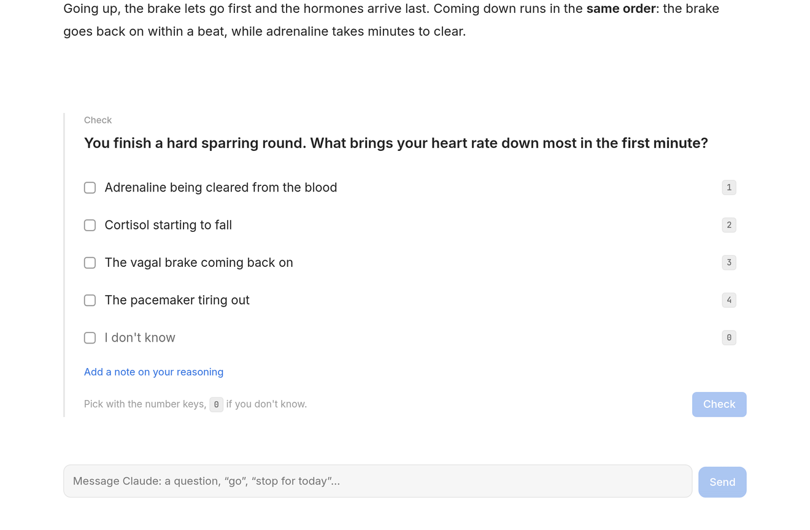</picture>
</p>
<p align="center"><sub>Recorded in the demo library, in focus mode. The tutor's turns go through the same MCP tools Claude Code calls (<code>quiz</code>, <code>ask</code>, <code>show</code>, <code>update_map</code>).</sub></p>

## The method

Understanding is not something you can be handed. It is built by **struggling with the material at the edge of what you can do**, the way a muscle is built by load. AI is the equipment: it finds that edge, loads it, and checks the result honestly. The idea comes from Eero Alvar's [Bodybuilding for the Mind](https://www.youtube.com/watch?v=o0DtxUJ6rAc).

<p align="center">
  <picture><source media="(prefers-color-scheme: dark)" srcset="docs/images/method-dark.svg">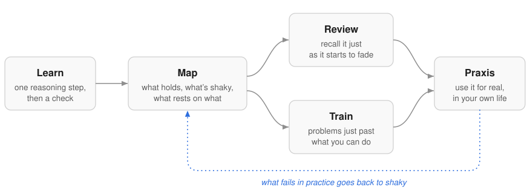</picture>
</p>

| | What happens | Why |
|---|---|---|
| **Learn** | The tutor probes what you already know, plans the territory, then teaches **one step at a time**, each followed by a quiz or a question you answer in writing. Beside every step, a chat with Aristotle answers whatever you wonder about, without moving the lesson. | Producing an answer is a far stronger test of understanding than recognising one. |
| **Map** | Every concept you meet goes on a knowledge map with its prerequisites, marked *not yet*, *shaky* or *solid*, with the evidence behind each mark. | You always see what you actually hold, and the tutor never builds on sand. |
| **Review** | Each solid concept carries a spaced-repetition card ([FSRS](https://github.com/open-spaced-repetition/ts-fsrs)). When it starts to fade, you recall it from memory. | Retrieval just before forgetting is what makes knowledge last. |
| **Train** | Problem sets on a topic, pitched just above your level, solved without help and then critiqued. Difficulty rises as you solve them cleanly. | Progressive overload, for thinking. |
| **Praxis** | Every course ends with a **mission**: a real task that puts it to work for your own advantage, in your projects, your sport, your computer, or anywhere, designed on its own when the last class is done from where you said you'd use it. You report back; the tutor checks what it can and reviews it honestly. | Knowledge you have never used is a guess. The mission is where it becomes yours, and where the map learns what really holds up. |

Bigger subjects are planned as **courses**: an ordered path of classes, agreed with you before any of it is taught, ending in a final mission that uses the whole path at once. A class is its steps, one page each, whichever sitting taught them.

There is no stop button. Take as long as a hard question needs: while you are working on the page, the tutor waits. Walk away with a question open and the sitting closes itself; answer it whenever you come back and the tutor picks up at that same step, not a new one.

## Learn anything

Any subject, at any depth. Here is one lesson from each of four courses, in medicine, chemistry, physics and history, and the figures move: these are recordings of the app itself. Click one to see it full size.

### Medicine · How the heart keeps time
<table>
  <tr>
    <td width="50%" valign="top"><a href="docs/images/med-plate-dark.webp"><picture><source media="(prefers-color-scheme: dark)" srcset="docs/images/med-plate-dark.webp">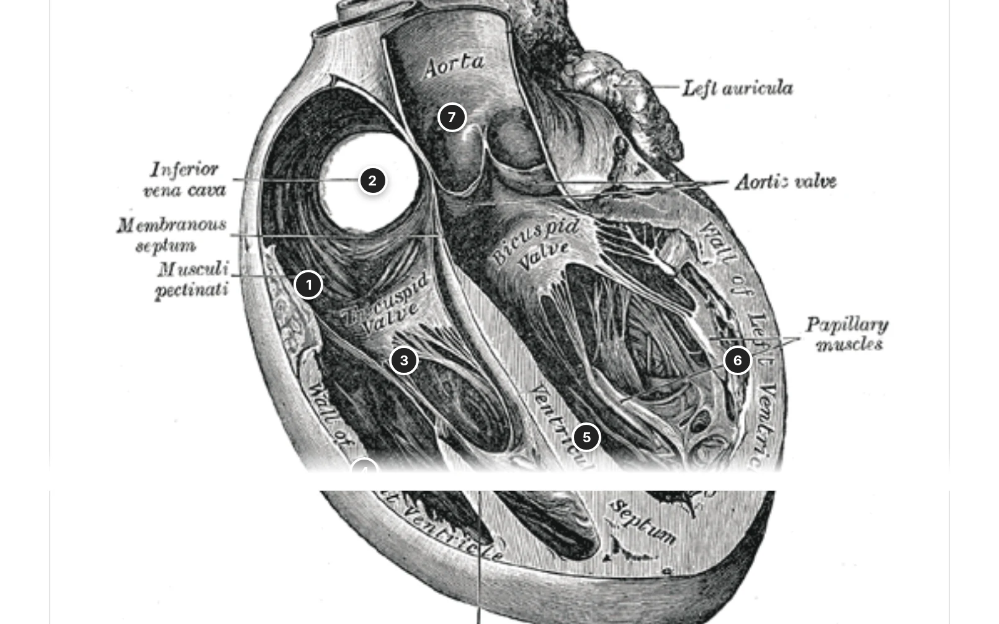</picture></a><p><b>Plates.</b> Real images with numbered markers and a key: point at a marker and its part lights up in both. Used only when the licence allows it (here Gray's Anatomy, 1918, public domain).</p></td>
    <td width="50%" valign="top"><a href="docs/images/med-explorable-dark.webp"><picture><source media="(prefers-color-scheme: dark)" srcset="docs/images/med-explorable-dark.webp">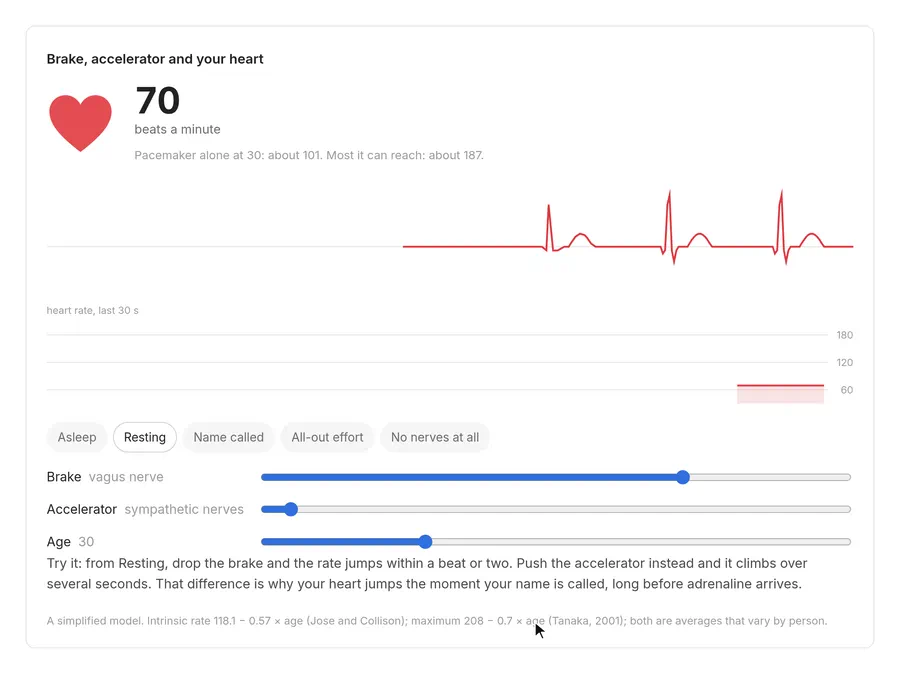</picture></a><p><b>Explorables.</b> Hand-built simulations you work with your hands. Drop the vagal brake and the heart jumps within a beat; push the accelerator instead and it climbs over seconds. The difference is the lesson.</p></td>
  </tr>
  <tr>
    <td width="50%" valign="top"><a href="docs/images/med-timeline-dark.webp"><picture><source media="(prefers-color-scheme: dark)" srcset="docs/images/med-timeline-dark.webp">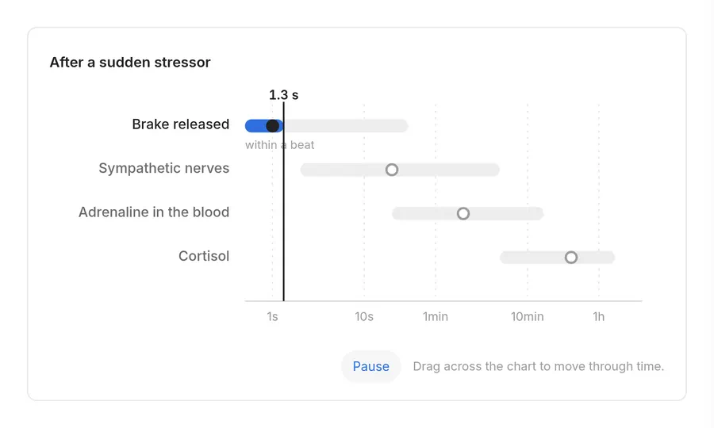</picture></a><p><b>Timelines.</b> On a log scale, so a second and an hour fit on one line. It plays by itself, and you can drag across it to move through time.</p></td>
    <td width="50%" valign="top"><a href="docs/images/hover-dark.webp"><picture><source media="(prefers-color-scheme: dark)" srcset="docs/images/hover-dark.webp">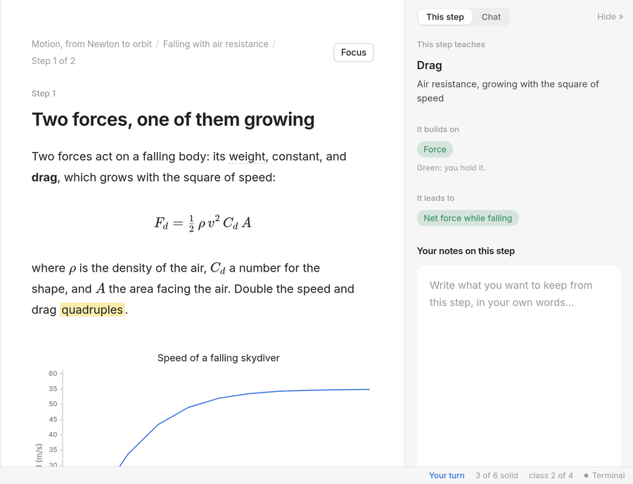</picture></a><p><b>Hover cards.</b> Every term carries its definition, maths included, and every concept shows how well you hold it and when it is next due. Nothing makes you leave the page.</p></td>
  </tr>
</table>

### Chemistry · How cells release energy
<p><a href="docs/images/chem-flow-dark.webp"><picture><source media="(prefers-color-scheme: dark)" srcset="docs/images/chem-flow-dark.webp">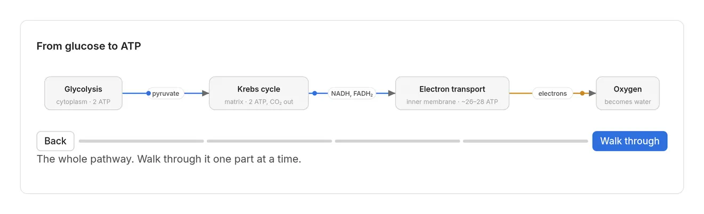</picture></a></p>
<p><b>Flows.</b> A pathway you walk through one stage at a time, with the things it moves drawn as themselves: glucose in its ring, pyruvate and NADH riding the arrows, electrons on their way to oxygen, ATP, CO₂ and water rising out of the stage that makes them.</p>

### Physics · Falling with air resistance
<table>
  <tr>
    <td width="50%" valign="top"><a href="docs/images/phys-chart-dark.webp"><picture><source media="(prefers-color-scheme: dark)" srcset="docs/images/phys-chart-dark.webp">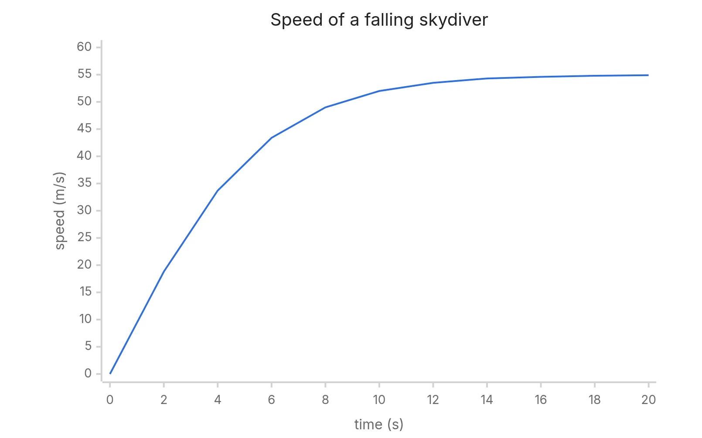</picture></a><p><b>Charts and maths.</b> LaTeX for the equations and charts drawn from them: drag grows with the square of speed, so the curve flattens.</p></td>
    <td width="50%" valign="top"><a href="docs/images/phys-balance-dark.webp"><picture><source media="(prefers-color-scheme: dark)" srcset="docs/images/phys-balance-dark.webp">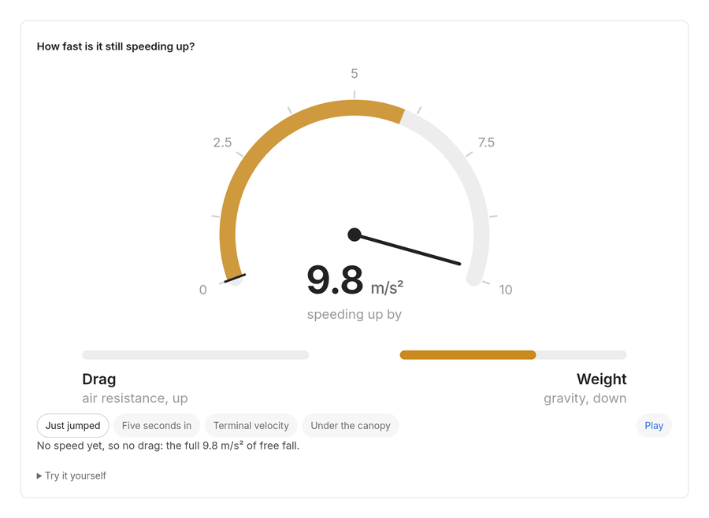</picture></a><p><b>Balances.</b> Two forces on one value, with states to step through: just jumped, five seconds in, terminal velocity, under the canopy. Watch drag catch up with weight.</p></td>
  </tr>
</table>

### History · The printing press
<table>
  <tr>
    <td width="50%" valign="top"><a href="docs/images/hist-plate-dark.webp"><picture><source media="(prefers-color-scheme: dark)" srcset="docs/images/hist-plate-dark.webp">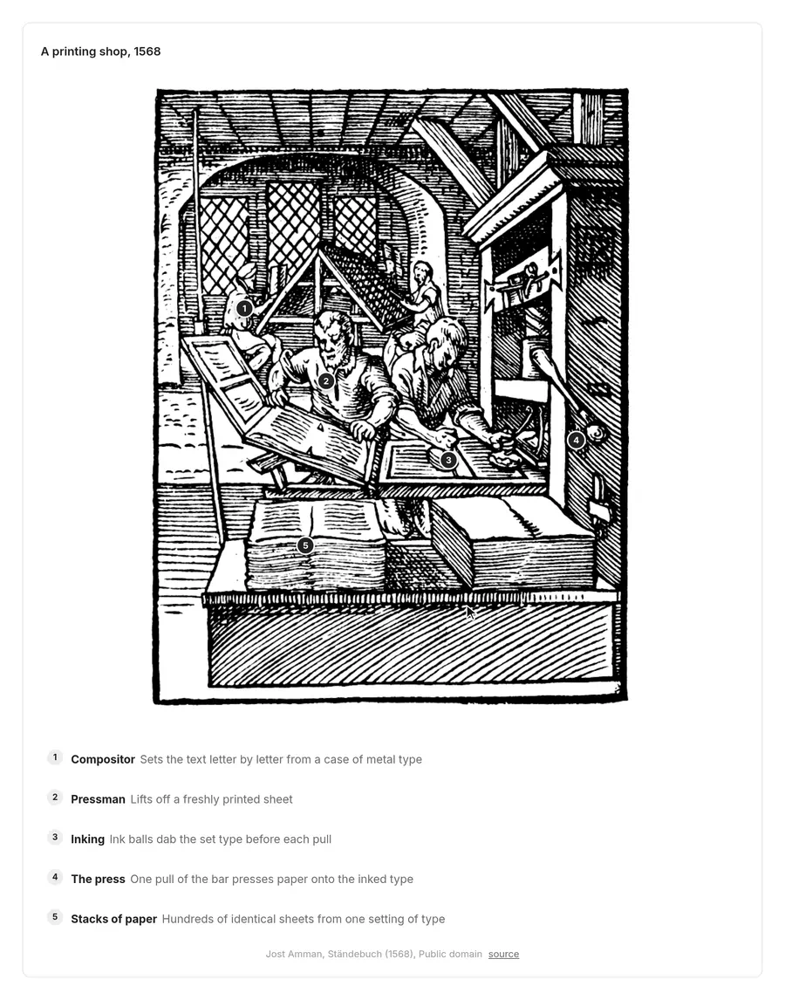</picture></a><p><b>Sources you can point at.</b> A woodcut from 1568 shows the whole process in one room. Each marker lights up its part: setting type, inking, pulling the press, stacking identical sheets.</p></td>
    <td width="50%" valign="top"><a href="docs/images/hist-timeline-dark.webp"><picture><source media="(prefers-color-scheme: dark)" srcset="docs/images/hist-timeline-dark.webp">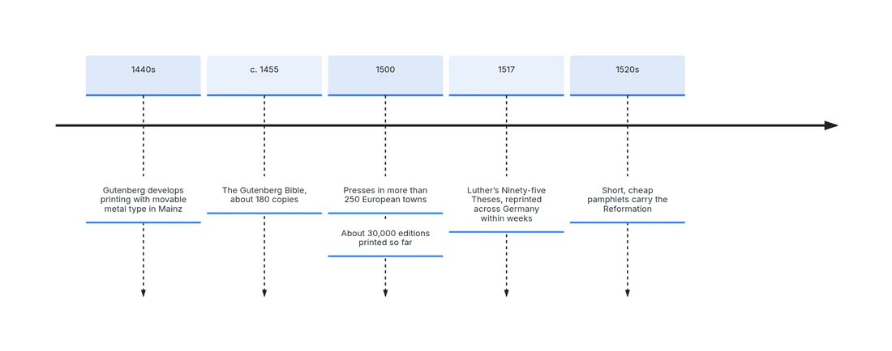</picture></a><p><b>Mermaid diagrams.</b> Here a timeline: seventy years from Gutenberg’s first Bible to the pamphlets of the Reformation, and why the speed of print changed the argument.</p></td>
  </tr>
</table>

Also: step-through sequences, callouts, highlights, and drawings the tutor makes for the step at hand, checked rendered in both themes before you see them.

## Around the lessons

<table>
  <tr>
    <td width="50%" valign="top"><a href="docs/images/home-dark.webp"><picture><source media="(prefers-color-scheme: dark)" srcset="docs/images/home-dark.webp">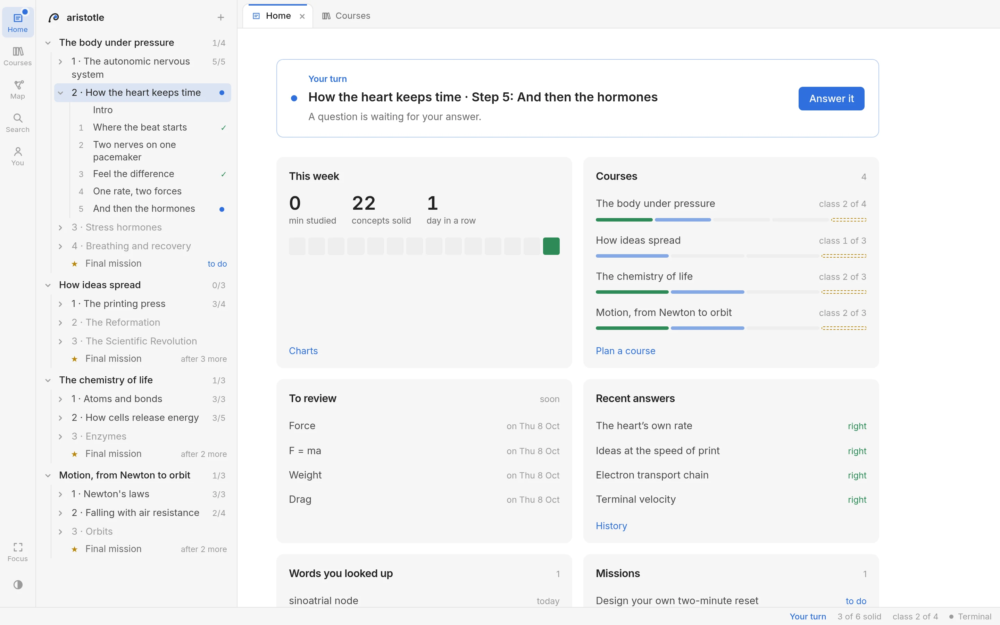</picture></a><p><b>Home.</b> One card says what to do now. Around it: your week, your courses, what is coming due for review, your latest answers, the words you looked up and your missions.</p></td>
    <td width="50%" valign="top"><a href="docs/images/class-dark.webp"><picture><source media="(prefers-color-scheme: dark)" srcset="docs/images/class-dark.webp">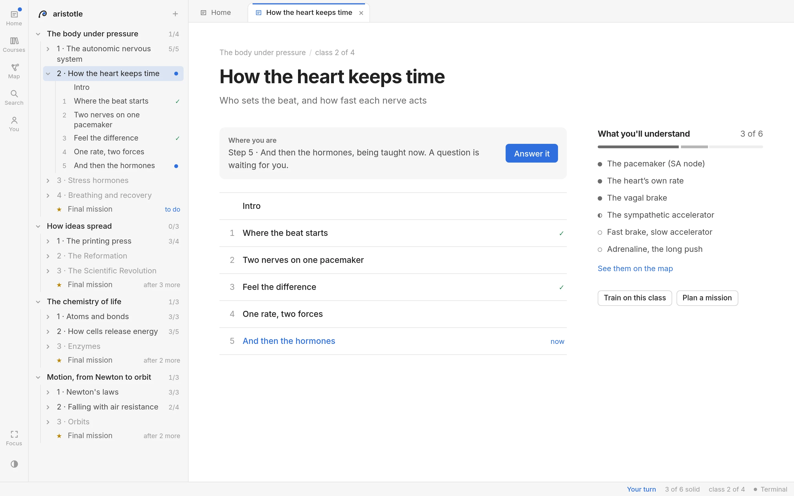</picture></a><p><b>A class is its steps.</b> Where you are, with the one thing to do next; every step with how its checks went; and what the class teaches, solid or not yet.</p></td>
  </tr>
</table>
<table>
  <tr>
    <td width="50%" valign="top"><a href="docs/images/chat-dark.webp"><picture><source media="(prefers-color-scheme: dark)" srcset="docs/images/chat-dark.webp">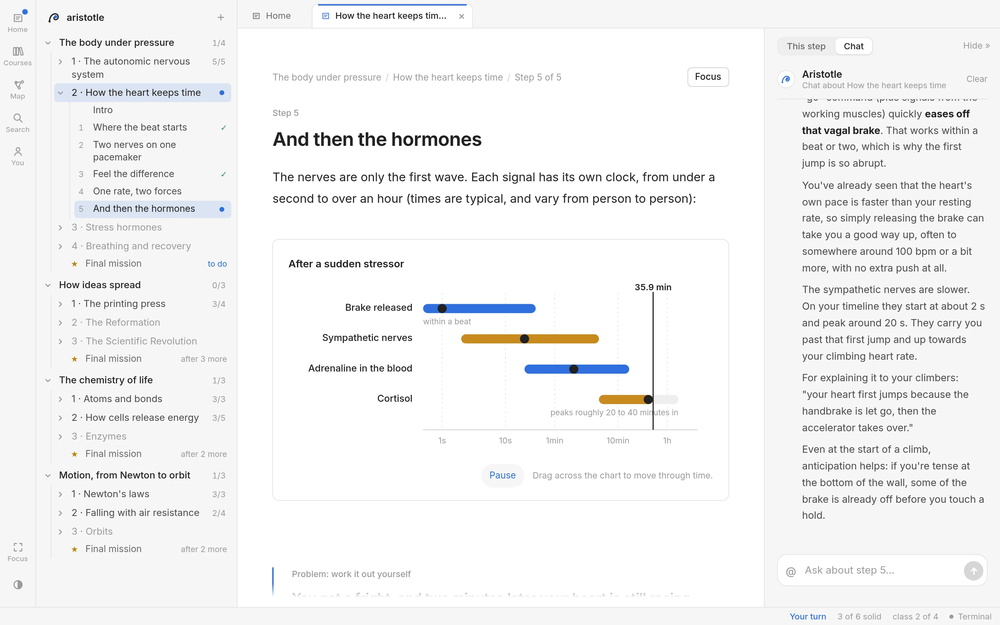</picture></a><p><b>Talk to Aristotle while you read.</b> The chat beside every step sees what you are reading, answers even while a question waits for you, takes <kbd>@</kbd> tags of steps and concepts, and never moves the lesson. Select a word to gloss it, or a passage to ask about it.</p></td>
    <td width="50%" valign="top"><a href="docs/images/roadmap-dark.webp"><picture><source media="(prefers-color-scheme: dark)" srcset="docs/images/roadmap-dark.webp">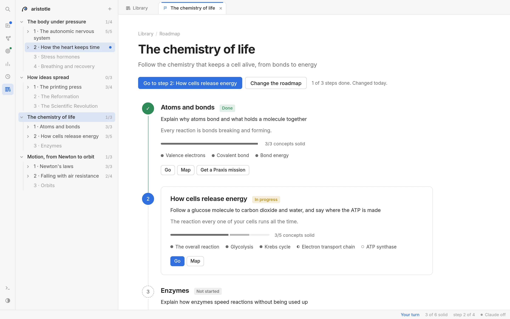</picture></a><p><b>Courses.</b> Each class has its goal and why it sits where it does. Progress is read off the knowledge maps, so it is always true, and the course ends with its final mission.</p></td>
  </tr>
</table>
<table>
  <tr>
    <td width="50%" valign="top"><a href="docs/images/mission-dark.webp"><picture><source media="(prefers-color-scheme: dark)" srcset="docs/images/mission-dark.webp">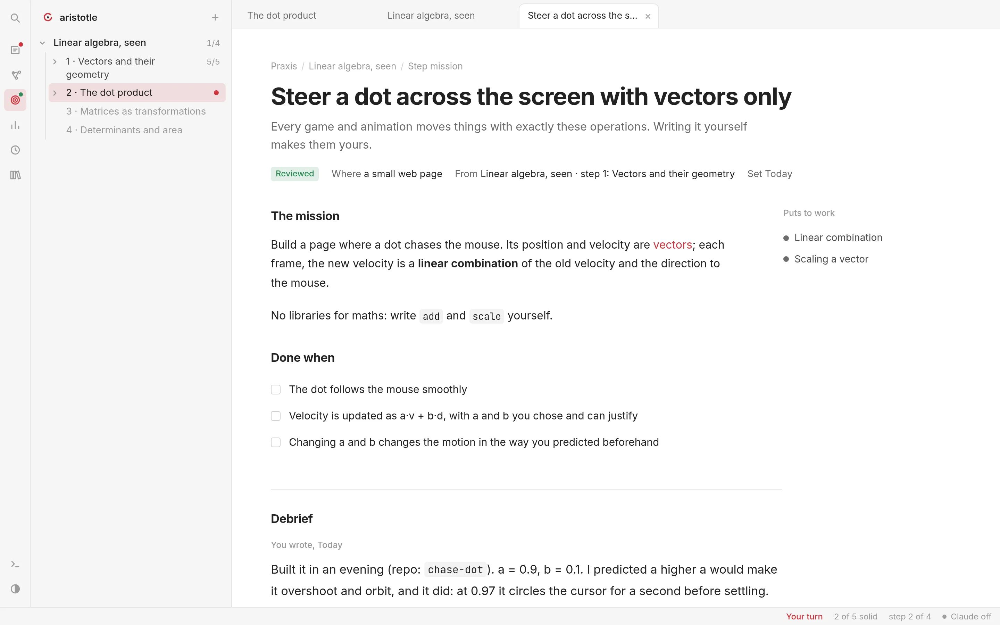</picture></a><p><b>Missions.</b> A real task in your own life, with a clear “done when”, your debrief and an honest review. A miss in practice sends a concept back to shaky.</p></td>
    <td width="50%" valign="top"><a href="docs/images/search-dark.webp"><picture><source media="(prefers-color-scheme: dark)" srcset="docs/images/search-dark.webp">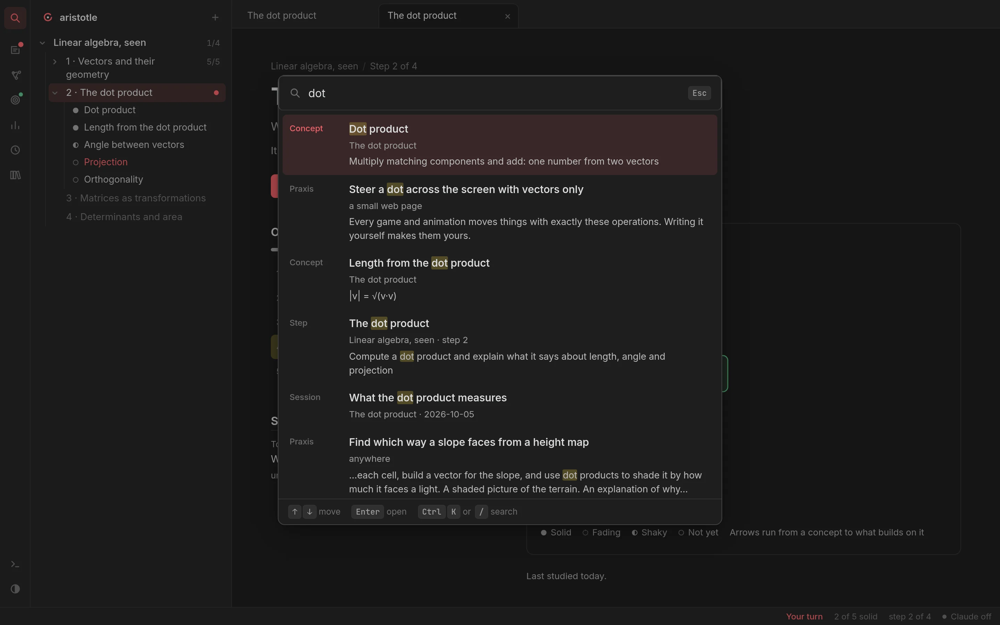</picture></a><p><b>Search everything.</b> <kbd>Ctrl</kbd> <kbd>K</kbd> or <kbd>/</kbd> finds courses, classes, concepts, missions, and anything said in any session, your own answers included.</p></td>
  </tr>
</table>

Plus your own notes on every step, an About you page that missions and courses are built from, a Progress page, a replayable history, focus mode (<kbd>F</kbd>), light and dark themes, and the tutor's own terminal one keystroke away (<kbd>Ctrl</kbd> <kbd>`</kbd>), opening by itself when it needs you.

## Quick start

**You need** Linux or macOS, [Node.js](https://nodejs.org) 24.2 or newer, [pnpm](https://pnpm.io), and a tutor: [Claude Code](https://claude.com/claude-code) signed in with a Claude subscription, or [another one](#another-tutor). `rsvg-convert` (librsvg) is optional, for checking drawings before they are shown.

```sh
git clone https://github.com/Di0go/aristotle.git
cd aristotle
pnpm install
pnpm start          # builds the interface and starts the server
```

Open **http://localhost:4747** and type what you want to learn, or plan a course. Aristotle starts Claude Code by itself when you open it (in a terminal inside the app, on your own login), and the lesson begins. The first time, Claude Code asks you to trust the folder and to enable the `aristotle` MCP server: accept both.

You can also talk to the tutor from your own terminal: run `claude` in the project folder and say `/teach <anything>`.

### Another tutor

Open **Settings** (in the left strip) and choose who teaches. Whichever you choose works through the same tools and follows the same method, and your library stays as it is.

| Tutor | What you need |
|---|---|
| **Claude Code** (default) | Claude Code, on your Claude subscription |
| **Codex CLI**, **Gemini CLI**, **opencode** | The CLI installed and signed in. It runs in the same drawer, reaches Aristotle's tools over MCP, and reads the method through them (this folder has their config: `opencode.json`, `.gemini/settings.json`, and Codex gets its own on the command line). |
| **A model API** | An address and a model: [OpenRouter](https://openrouter.ai) or OpenAI with a key, or a local server with none (Ollama, LM Studio, llama.cpp, vLLM). Aristotle runs the tutor itself: the conversation, the tools, a web search to check facts. Pick a model that can call tools; a local one needs a context of 32k tokens or more (for Ollama: `OLLAMA_CONTEXT_LENGTH=64000`). |

Glosses, questions on a passage and the chat beside a lesson can run on the model API too, with a smaller model if you like. Any other MCP client can teach from its own window too: point it at `node server/bridge.ts` (or `http://127.0.0.1:4747/mcp`) and ask it to use the `method` tool.

<details>
<summary><b>Optional (Linux): run it at login, and give it a clean https name</b></summary>

<br>

```sh
bash scripts/install-service.sh         # a systemd user service: always on, no root
bash scripts/tls.sh                     # a certificate authority that can only sign aristotle.test
pkexec bash scripts/setup-hostname.sh   # hosts entry, port forwarding, trust store (root, once)
pnpm app restart
```

Then Aristotle lives at **https://aristotle.test**. The certificate authority is limited to that one name by `nameConstraints`, so trusting it cannot vouch for any other site. Each script explains in its header what it changes and how to undo it.

</details>

### Commands

| Command | What it does |
|---|---|
| `pnpm start` | Build the interface and (re)start the server |
| `pnpm app status` · `start` · `stop` · `restart` | Control the server (through systemd when the service is installed) |
| `pnpm dev` | A separate dev instance with demo data, reloaded as you edit ([make it yours](#make-it-yours)) |
| `pnpm release` | Ship what you committed to the app you learn in, with a rollback |
| `pnpm gates` | Every check: docs, lint, types, end-to-end tests, build |

### Ask the tutor

In Claude Code these are slash commands; any other tutor gets the same skill when you ask for it in words ("teach me …", "review what's fading"), or as a prompt where the client offers them.

| Skill | For |
|---|---|
| `/teach <topic>` | A lesson, or `continue` where you left off |
| `/roadmap <area>` | Plan a course with you: an ordered path of classes |
| `/review` | Recall what is fading, across every topic |
| `/train <topic>` | A training set at the edge of your level |
| `/praxis` | Design a mission (every course gets its final one on its own), or review your debrief |

## How it works

<p align="center">
  <picture><source media="(prefers-color-scheme: dark)" srcset="docs/images/architecture-dark.svg">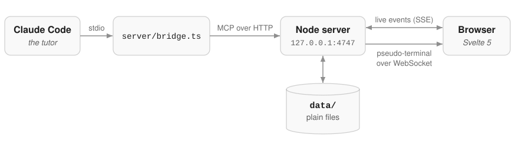</picture>
</p>

- **An agent is the tutor; the server is the classroom.** The server exposes its tools over [MCP](https://modelcontextprotocol.io) (`show`, `quiz`, `ask`, `update_map`, `record_practice`, `save_roadmap`, `save_mission`, `review_mission` and more), and the bridge starts it on demand. A question waits for your answer in the browser and hands it back to the tutor, so it reacts to what you actually wrote. Any MCP client can be the tutor; with a model API, Aristotle runs the tutor itself, calling the same tools in process.
- **The method lives in skills** (`.claude/skills/`): `teach`, `review`, `train`, `roadmap` and `praxis`. A `researcher` subagent fact-checks claims before they are taught, and an `illustrator` subagent draws diagrams and checks them rendered in both themes. Claude Code loads them itself; every other tutor reads them through the `method` tool, and the rules every sitting keeps are in `AGENTS.md`.
- **A second assistant beside the tutor.** The chat, glosses and questions on a passage run `claude -p` on your own login, headless and with no tools (or the model API, if you choose), given what you are looking at; the chat continues one conversation per class. The tutor reads what you asked there.
- **The tutor in the page.** The server runs the agent (`claude`, or the one you chose) in a pseudo-terminal and streams it to a terminal in the interface, started when you open the app. It is the ordinary interactive agent on your own login. The API tutor shows its conversation there instead. Its WebSocket only accepts the app's own pages (exact Host and Origin checks), no other site can frame the app, and the server only listens on loopback and only answers your own user's connections.
- **Your data is plain files**, written atomically and readable without the app:

  ```
  data/
  ├── topics/      one knowledge map per topic (JSON): concepts, prerequisites, evidence, review cards
  ├── sessions/    one append-only log per session (JSON Lines), replayable
  ├── roadmaps/    one file per course
  ├── missions/    one file per mission, with its debrief and review
  ├── chats/       the chat beside each class
  ├── glosses.json, asides.json, notes.json   words you looked up, questions on passages, your notes on steps
  ├── about.md     About you, in your words
  └── profile.md   what the tutor has learned about how you learn (the `profile` tool)
  ```

  `data/` is never part of this repository (it is in `.gitignore`), so your learning history stays yours.

### Keep a history of your data, and back it up

Make `data/` a Git repository of its own and the server versions it for you: after ten quiet minutes, or when a session ends, it commits whatever changed. Add a remote and it pushes too. Without a remote, the history stays on your machine.

```sh
cd data
git init -b main
git add -A && git commit -m "My learning history"

# Optional: back it up to a repository of your own. Make it PRIVATE: it holds everything you studied and wrote.
git remote add origin git@github.com:<you>/<your-private-data-repo>.git
git push -u origin main

cd .. && pnpm app restart
```

To pause it, start the server with `ARISTOTLE_BACKUP=off`. To stop backing up to the remote, `git -C data remote remove origin`. Your files keep working either way; Git only adds their history.

## Make it yours

Aristotle is meant to change as you use it. `pnpm dev` runs a second instance beside the one you learn in, with its own port and a demo library, so you can try a change without touching your lessons. `pnpm release` ships it to your real app once it passes every check, and `pnpm release --rollback` undoes it. Open Claude Code in the project and ask for what you want: the repository tells it how.

```
server/      Node HTTP server, run directly as TypeScript: MCP tools, feed, maps, reviews, missions, search
ui/          Svelte 5 + Vite interface: pages, the visual kit, explorables, charts
shared/      types shared by both
.claude/     the skills and subagents that make up the method (AGENTS.md: the rules every tutor keeps)
scripts/     dev instance, seed data, gates, release, docs, the login service and hostname setup
tests/       end-to-end tests, and the tests that keep the docs true
docs/        how it is built and how to change it
```

Start at [docs/README.md](docs/README.md) and [CONTRIBUTING.md](CONTRIBUTING.md).

## Credits

- **Eero Alvar** for the method and the idea: [How I Use AI to Learn Things](https://youtu.be/kzcI5F4tGiU) (probe, plan, teach one reasoning step at a time, quizzes as feedback, engineered trust) and [Bodybuilding for the Mind](https://www.youtube.com/watch?v=o0DtxUJ6rAc) (struggle as the training signal, AI as the training equipment).
- **[amosblomqvist/learn](https://github.com/amosblomqvist/learn)**: the original setup from that video, for the pi agent. Its teaching principles and quiz design inspired this project's. No text or code is copied (the repository has no licence).
- **[vasanthsreeram/Alvarmethod](https://github.com/vasanthsreeram/Alvarmethod)** (MIT): the port to Claude Code and other agents, and the idea of per-topic maps and resumable session files.
- **[ts-fsrs](https://github.com/open-spaced-repetition/ts-fsrs)** for spaced repetition. The epigraph is from Aristotle's *Nicomachean Ethics*, Book II, in W. D. Ross's translation.
- **Images in the demo lessons**, all from Wikimedia Commons: the heart, Henry Vandyke Carter for *Gray's Anatomy* (1918, public domain); the print shop, Jost Amman’s woodcut from the *Ständebuch* (1568, public domain).

## License

[MIT](LICENSE). The images in the demo lessons keep their own licences (see Credits).
