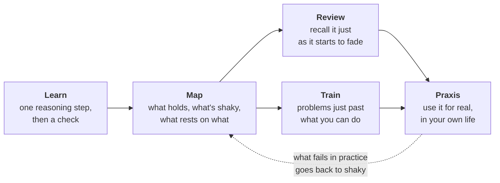
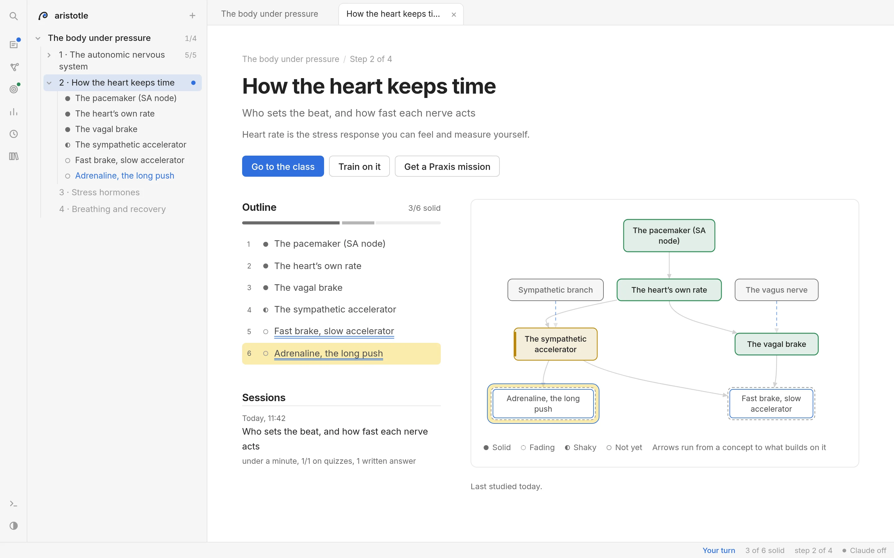
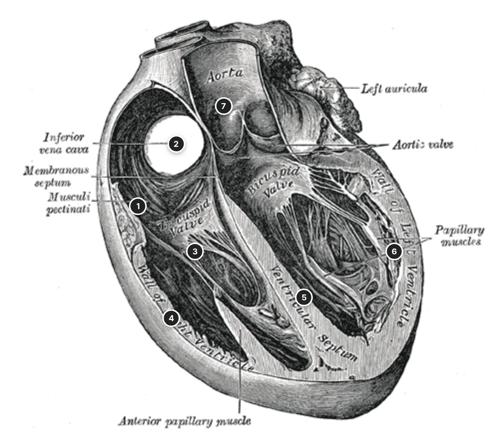
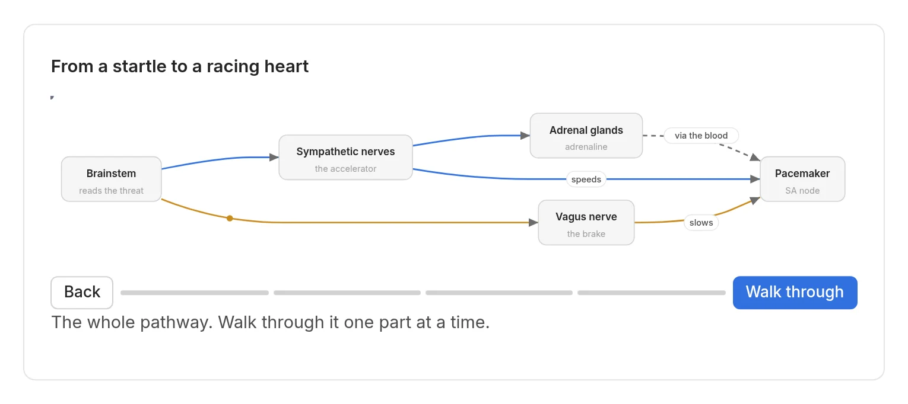
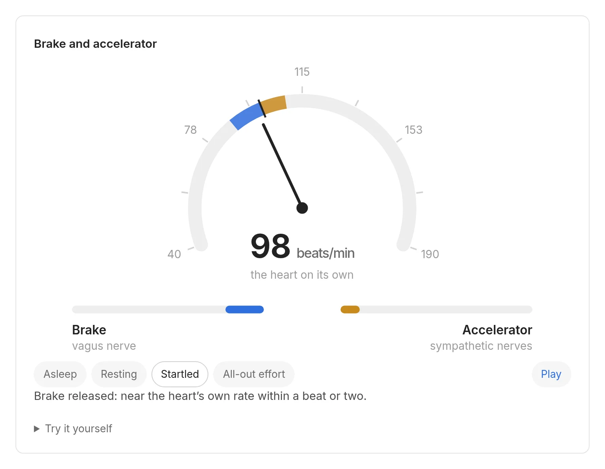
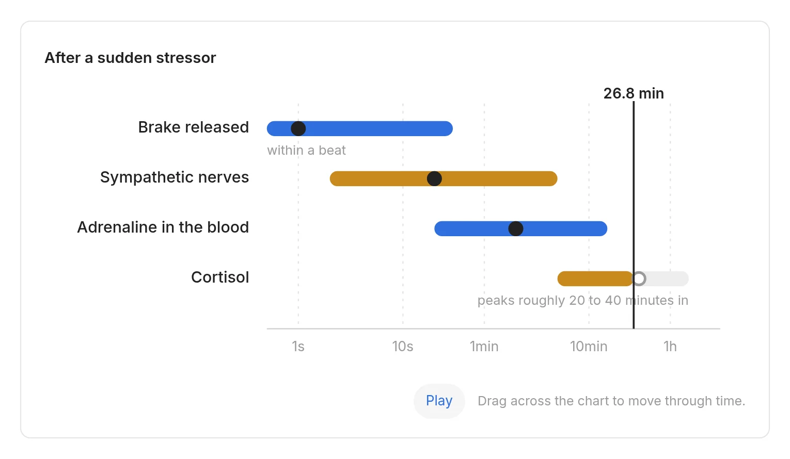
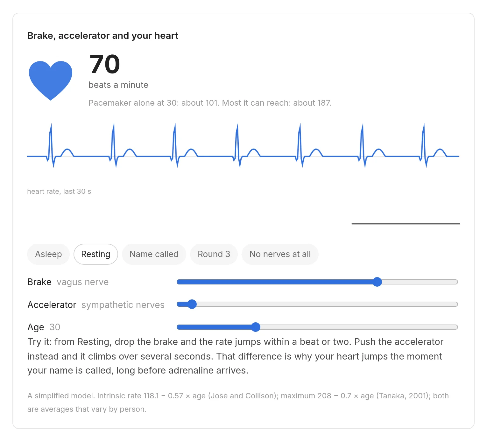
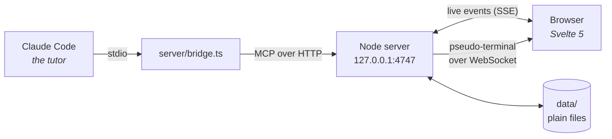

<p align="center">
  <picture>
    <source media="(prefers-color-scheme: dark)" srcset="docs/images/banner-dark.svg">
    
  </picture>
</p>

<p align="center">
  <a href="#quick-start">Quick start</a> ·
  <a href="#the-method">The method</a> ·
  <a href="#a-tour">A tour</a> ·
  <a href="#the-visual-kit">The visual kit</a> ·
  <a href="#how-it-works">How it works</a> ·
  <a href="#credits">Credits</a>
</p>

<p align="center">
  
  
  
  
  
</p>

---

**Aristotle is a personal tutor that lives on your machine.** [Claude Code](https://claude.com/claude-code) does the teaching; Aristotle is the room you learn in: lessons one reasoning step at a time, questions you answer in your own words, a living map of what you understand, spaced review before things fade, training sets that get harder as you do, and missions that take what you learned out into your own life.

It runs on your Claude subscription. No API keys, no accounts, no cloud: everything you learn is a plain file you own.

> Aristotle tutored a teenage Alexander from 343 BC. This one is more patient, and it is yours.

<p align="center">
  <a href="docs/images/hero-dark.webp"><picture>
        <source media="(prefers-color-scheme: dark)" srcset="docs/images/hero-dark.webp">
        
      </picture></a>
</p>

<p align="center"><sub>A live lesson. The figure is real and interactive: the tutor asked to drop the brake, then push the accelerator, and feel which one is fast.</sub></p>

## The method

Understanding is not something you can be handed. It is built by **struggling with the material at the edge of what you can do**, the way a muscle is built by load. AI is the equipment: it finds that edge, loads it, and checks the result honestly. The idea comes from Eero Alvar's [Bodybuilding for the Mind](https://www.youtube.com/watch?v=o0DtxUJ6rAc).



| | What happens | Why |
|---|---|---|
| **Learn** | The tutor probes what you already know, plans the territory, then teaches **one step at a time**, each followed by a quiz or a question you answer in writing. | Producing an answer is a far stronger test of understanding than recognising one. |
| **Map** | Every concept you meet goes on a knowledge map with its prerequisites, marked *not yet*, *shaky* or *solid*, with the evidence behind each mark. | You always see what you actually hold, and the tutor never builds on sand. |
| **Review** | Each solid concept carries a spaced-repetition card ([FSRS](https://github.com/open-spaced-repetition/ts-fsrs)). When it starts to fade, you recall it from memory. | Retrieval just before forgetting is what makes knowledge last. |
| **Train** | Problem sets on a topic, pitched just above your level, solved without help and then critiqued. Difficulty rises as you solve them cleanly. | Progressive overload, for thinking. |
| **Praxis** | When a step of a roadmap is done, you get a **mission**: a real task that puts it to work for your own advantage, in your projects, your sport, your computer, or anywhere. You report back; the tutor checks what it can and reviews it honestly. | Knowledge you have never used is a guess. The mission is where it becomes yours, and where the map learns what really holds up. |

Bigger subjects are planned as **roadmaps**: an ordered path of topics, agreed with you before any of it is taught, ending in a capstone mission that uses the whole path at once.

## A tour

<table>
  <tr>
    <td width="50%" valign="top">
      <a href="docs/images/roadmap-dark.webp"><picture>
        <source media="(prefers-color-scheme: dark)" srcset="docs/images/roadmap-dark.webp">
        
      </picture></a>
      <p><b>Roadmaps.</b> A path of topics, each with its goal and why it sits where it does. Progress is read off the knowledge maps, so it is always true.</p>
    </td>
    <td width="50%" valign="top">
      <a href="docs/images/mission-dark.webp"><picture>
        <source media="(prefers-color-scheme: dark)" srcset="docs/images/mission-dark.webp">
        
      </picture></a>
      <p><b>Praxis.</b> A mission with a clear "done when", the concepts it puts to work, your debrief and the tutor's review. A miss in practice sends a concept back to shaky.</p>
    </td>
  </tr>
  <tr>
    <td width="50%" valign="top">
      <a href="docs/images/topic-dark.webp"><picture>
        <source media="(prefers-color-scheme: dark)" srcset="docs/images/topic-dark.webp">
        
      </picture></a>
      <p><b>Knowledge maps.</b> Every topic as a graph of concepts and what they rest on, across topics too. Hover a concept anywhere for its card.</p>
    </td>
    <td width="50%" valign="top">
      <a href="docs/images/search-dark.webp"><picture>
        <source media="(prefers-color-scheme: dark)" srcset="docs/images/search-dark.webp">
        
      </picture></a>
      <p><b>Search everything.</b> <kbd>Ctrl</kbd> <kbd>K</kbd> or <kbd>/</kbd> finds roadmaps, concepts, missions, and anything said in any session, your own answers included.</p>
    </td>
  </tr>
</table>

## The visual kit

Words alone are the weakest way to teach anything physical, spatial or timed. The tutor writes a few lines of JSON; Aristotle draws them, animates them and makes them explorable. Every figure below is from the same lesson. Click any image to see it full size; in the app, click a figure to open it large.

<p align="center">
  <a href="docs/images/kit-plate-dark.webp"><picture>
        <source media="(prefers-color-scheme: dark)" srcset="docs/images/kit-plate-dark.webp">
        
      </picture></a>
</p>
<p align="center"><sub><b>Plates.</b> Real images with numbered markers and a key, taken only from files whose licence allows reuse (here, Gray's Anatomy, 1918, public domain).</sub></p>

<table>
  <tr>
    <td width="50%" valign="top">
      <a href="docs/images/kit-flow-dark.webp"><picture>
        <source media="(prefers-color-scheme: dark)" srcset="docs/images/kit-flow-dark.webp">
        
      </picture></a>
      <p><b>Flows.</b> A pathway you walk through one step at a time, with signals moving along it: fast routes, opposing routes, slow ones.</p>
    </td>
    <td width="50%" valign="top">
      <a href="docs/images/kit-balance-dark.webp"><picture>
        <source media="(prefers-color-scheme: dark)" srcset="docs/images/kit-balance-dark.webp">
        
      </picture></a>
      <p><b>Balances.</b> Two forces on one value, with states to step through (asleep, resting, startled, all-out) and sliders to try your own.</p>
    </td>
  </tr>
  <tr>
    <td width="50%" valign="top">
      <a href="docs/images/kit-timeline-dark.webp"><picture>
        <source media="(prefers-color-scheme: dark)" srcset="docs/images/kit-timeline-dark.webp">
        
      </picture></a>
      <p><b>Timelines.</b> Things that happen on very different clocks, on a log scale you can play or scrub, from under a second to hours.</p>
    </td>
    <td width="50%" valign="top">
      <a href="docs/images/kit-explorable-dark.webp"><picture>
        <source media="(prefers-color-scheme: dark)" srcset="docs/images/kit-explorable-dark.webp">
        
      </picture></a>
      <p><b>Explorables.</b> Hand-built simulations for the ideas that deserve one. You move the inputs, and the lesson asks what you noticed.</p>
    </td>
  </tr>
</table>

Plus LaTeX maths, Mermaid diagrams, step-through sequences, hover cards on every term and concept, a Progress page (what's fading, solid concepts over time, training levels), a replayable log of every session, light and dark themes, and Claude Code itself in a drawer at the bottom of every page.

## Quick start

**You need** Linux or macOS, [Node.js](https://nodejs.org) 24.2 or newer, [pnpm](https://pnpm.io), and [Claude Code](https://claude.com/claude-code) signed in with a Claude subscription. `rsvg-convert` (librsvg) is optional, for checking drawings before they are shown.

```sh
git clone https://github.com/Di0go/aristotle.git
cd aristotle
pnpm install
pnpm start          # builds the interface and starts the server
```

Open **http://localhost:4747** and type what you want to learn, or plan a roadmap. Aristotle starts Claude Code inside itself (in the drawer, on your own login) and the lesson begins. The first time, Claude Code asks you to trust the folder and to enable the `aristotle` MCP server: accept both.

You can also talk to the tutor from your own terminal: run `claude` in the project folder and say `/teach <anything>`.

<details>
<summary><b>Optional (Linux): run it at login, and give it a clean https name</b></summary>

<br>

```sh
bash scripts/install-service.sh         # a systemd user service: always on, no root
bash scripts/tls.sh                     # a certificate authority that can only sign aristotle.test
pkexec bash scripts/setup-hostname.sh   # hosts entry, port forwarding, trust store (root, once)
pnpm app restart
```

Then Aristotle lives at **https://aristotle.test**. The certificate authority is limited to that one name by `nameConstraints`, so trusting it cannot vouch for any other site. Each script explains in its header what it changes and how to undo it.

</details>

### Commands

| Command | What it does |
|---|---|
| `pnpm start` | Build the interface and (re)start the server |
| `pnpm app status` · `start` · `stop` · `restart` | Control the server (through systemd when the service is installed) |
| `pnpm dev` | The server plus the Vite dev server, with reload |
| `pnpm check` | Type-check everything |
| `pnpm test` | End-to-end tests: a real server, a real MCP client, real HTTP answers |

### In Claude Code

| Skill | For |
|---|---|
| `/teach <topic>` | A lesson, or `continue` where you left off |
| `/roadmap <area>` | Plan an ordered path of topics with you |
| `/review` | Recall what is fading, across every topic |
| `/train <topic>` | A training set at the edge of your level |
| `/praxis` | Design a mission for a finished step or roadmap, or review your debrief |

## How it works



- **Claude Code is the tutor; the server is the classroom.** The server exposes its tools over [MCP](https://modelcontextprotocol.io) (`show`, `quiz`, `ask`, `update_map`, `record_practice`, `save_roadmap`, `save_mission`, `review_mission` and more), and the bridge starts it on demand. A question waits for your answer in the browser and hands it back to Claude, so the tutor reacts to what you actually wrote.
- **The method lives in skills** (`.claude/skills/`): `teach`, `review`, `train`, `roadmap` and `praxis`. A `researcher` subagent fact-checks claims before they are taught, and an `illustrator` subagent draws diagrams and checks them rendered in both themes.
- **Claude Code in the page.** The server can run `claude` in a pseudo-terminal and stream it to a drawer in the interface. It is the ordinary interactive Claude Code on your own subscription. Its WebSocket only accepts the app's own pages (Host and Origin checks), and the server only listens on 127.0.0.1.
- **Your data is plain files**, written atomically and readable without the app:

  ```
  data/
  ├── topics/      one knowledge map per topic (JSON): concepts, prerequisites, evidence, review cards
  ├── sessions/    one append-only log per session (JSON Lines), replayable
  ├── roadmaps/    one file per roadmap
  ├── missions/    one file per Praxis mission, with its debrief and review
  └── profile.md   what the tutor has learned about how you learn
  ```

  `data/` is never part of this repository (it is in `.gitignore`), so your learning history stays yours.

### Keep a history of your data, and back it up

Make `data/` a Git repository of its own and the server versions it for you: after ten quiet minutes, or when a session ends, it commits whatever changed. Add a remote and it pushes too. Without a remote, the history stays on your machine.

```sh
cd data
git init -b main
git add -A && git commit -m "My learning history"

# Optional: back it up to a repository of your own. Make it PRIVATE: it holds everything you studied and wrote.
git remote add origin git@github.com:<you>/<your-private-data-repo>.git
git push -u origin main

cd .. && pnpm app restart
```

To pause it, start the server with `DATA_BACKUP=off`. To stop backing up to the remote, `git -C data remote remove origin`. Your files keep working either way; Git only adds their history.

<details>
<summary><b>Project layout</b></summary>

<br>

```
server/      Node HTTP server, run directly as TypeScript: MCP tools, feed, maps, reviews, missions, search
ui/          Svelte 5 + Vite interface: pages, the visual kit, explorables, charts
shared/      types shared by both
.claude/     the skills and subagents that make up the method
scripts/     the optional login service, certificate and hostname setup
tests/       end-to-end tests
docs/        images for this page
```

</details>

## Credits

- **Eero Alvar** for the method and the idea: [How I Use AI to Learn Things](https://youtu.be/kzcI5F4tGiU) (probe, plan, teach one reasoning step at a time, quizzes as feedback, engineered trust) and [Bodybuilding for the Mind](https://www.youtube.com/watch?v=o0DtxUJ6rAc) (struggle as the training signal, AI as the training equipment).
- **[amosblomqvist/learn](https://github.com/amosblomqvist/learn)**: the original setup from that video, for the pi agent. Its teaching principles and quiz design inspired this project's. No text or code is copied (the repository has no licence).
- **[vasanthsreeram/Alvarmethod](https://github.com/vasanthsreeram/Alvarmethod)** (MIT): the port to Claude Code and other agents, and the idea of per-topic maps and resumable session files.
- **[ts-fsrs](https://github.com/open-spaced-repetition/ts-fsrs)** for spaced repetition. The epigraph is from Aristotle's *Nicomachean Ethics*, Book II, in W. D. Ross's translation.

## License

Not chosen yet. Until a licence is added, all rights are reserved.
