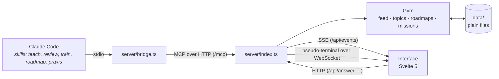

# Architecture

Claude Code is the tutor; Aristotle is the classroom. The tutor decides what to teach and when; the app shows it, collects the answers, and keeps the record.



## One lesson step, end to end

1. A skill (say `teach`) calls the MCP tool `show` with Markdown. Claude Code talks stdio to [`bridge.ts`](../server/bridge.ts), which starts the server if needed and relays to `/mcp`.
2. [`mcp.ts`](../server/mcp.ts) validates the input (zod) and calls the [`Gym`](../server/gym.ts), which adds an item to the session's [`Feed`](../server/feed.ts). The feed appends it to the session log in `data/sessions/` and emits an event.
3. The server streams the event over SSE (`/api/events`); [`feed.svelte.ts`](../ui/src/lib/feed.svelte.ts) puts it in reactive state, and the Now page renders it.
4. For `quiz` and `ask`, the tool call **waits** (up to `ARISTOTLE_WAIT_MS`, sending progress notifications so it does not look idle) until the learner answers in the page (`POST /api/answer`). The answer is recorded as evidence on the concept's map, and returned to Claude as the tool's result. If he is away, the tool returns "No answer yet" and Claude collects it later with `collect_answers`.
5. `update_map` changes the topic's knowledge map ([`topics.ts`](../server/topics.ts)), which the interface draws; `record_practice` moves spaced-review cards ([`reviews.ts`](../server/reviews.ts), FSRS).

Everything the learner sees is a projection of `data/`: restart the server and the same state comes back.

## The server

A plain Node HTTP server, run directly as TypeScript (Node's type stripping: only erasable syntax, `.ts` in imports). No framework: routing is a list of `if`s in [`index.ts`](../server/index.ts). One process holds the state in memory and writes through to files.

- **MCP** is stateless: a fresh `McpServer` per request on the Streamable HTTP transport, so restarting the server never strands Claude Code.
- **The interface** is the built `dist/ui`, served with long caching for hashed assets.
- **The terminal**: [`terminal.ts`](../server/terminal.ts) runs `claude` in a pseudo-terminal (node-pty) in the app's folder and streams it over a WebSocket to the drawer.
- **Backup**: [`backup.ts`](../server/backup.ts) commits `data/` (its own Git repository) after quiet periods and pushes if it has a remote.

### Security model

The server is for one person on one machine, but a browser runs other people's pages. So:

- it listens on **127.0.0.1 only**;
- every request must carry an allowed **Host** (`localhost`, `127.0.0.1` or the clean name, on a known port), which stops DNS rebinding;
- any request with an **Origin** must come from the app's own pages, which stops other sites posting answers;
- the **terminal WebSocket** runs Claude Code, so it demands an Origin, and an allowed one, always;
- the certificate authority for `aristotle.test` is limited to that name (`nameConstraints`), so trusting it cannot vouch for anything else.

## The interface

Svelte 5 (runes) built by Vite, no router library and no UI kit.

- **State** lives in a few rune modules: [`feed.svelte.ts`](../ui/src/lib/feed.svelte.ts) (the live session, topics, roadmaps, missions, kept current over SSE), [`router.svelte.ts`](../ui/src/lib/router.svelte.ts) (hash routes), [`tabs.svelte.ts`](../ui/src/lib/tabs.svelte.ts), [`theme.svelte.ts`](../ui/src/lib/theme.svelte.ts), [`claude.svelte.ts`](../ui/src/lib/claude.svelte.ts) (the terminal).
- **Pages** load on first visit ([`App.svelte`](../ui/src/App.svelte)), except Now, which is always ready.
- **Lessons** are Markdown rendered by [`markdown.ts`](../ui/src/lib/markdown.ts) (marked + KaTeX + DOMPurify) and brought to life by [`Markdown.svelte`](../ui/src/lib/Markdown.svelte): mermaid, sequences, explorables and the visual kit mount into fenced blocks. See [interface.md](interface.md).

## Claude Code's side

The method is in `.claude/`: skills Claude follows and subagents it calls. See [teaching.md](teaching.md).

<!-- generated: skills -->
| Kind | Name | What it is for |
|---|---|---|
| skill | [`praxis`](../.claude/skills/praxis/SKILL.md) | Praxis missions in Aristotle. |
| skill | [`review`](../.claude/skills/review/SKILL.md) | Spaced review in Aristotle. |
| skill | [`roadmap`](../.claude/skills/roadmap/SKILL.md) | Plan a roadmap with Diogo in Aristotle: an ordered path of topics towards something bigger, each with its own goal, agreed with him before any of it is taught. |
| skill | [`teach`](../.claude/skills/teach/SKILL.md) | Teach Diogo something in Aristotle so it is understood, not memorised. |
| skill | [`train`](../.claude/skills/train/SKILL.md) | Training sets in Aristotle. |
| agent | [`illustrator`](../.claude/agents/illustrator.md) | Draws a small, correct SVG diagram for one teaching step (optionally animated), checks it by rendering it in both themes, and returns the finished SVG. |
| agent | [`researcher`](../.claude/agents/researcher.md) | Fact-checks claims and scopes topics for the tutor. |
<!-- /generated -->

## MCP tools

<!-- generated: tools -->
| Tool | What it does |
|---|---|
| `list_topics` | List every topic the learner has studied, with how much of each map is solid and where the last session left off. |
| `get_topic` | Read a topic's knowledge map (every concept, its status, prerequisites, notes and check record), the last handoff, and recent sessions. |
| `list_roadmaps` | List his roadmaps: ordered paths of topics planned with him, with how far along each one is. |
| `get_roadmap` | Read a roadmap: its goal, and every step in order with its goal, why it comes there, and the state of the step's topic. |
| `save_roadmap` | Create a roadmap, or replace the steps of an existing one (pass its slug as `roadmap`): reordering, adding and dropping steps all go through here. |
| `save_mission` | Create a Praxis mission, or rewrite one (pass its id as `mission`): a real task he does outside the app that puts a step's (or a whole roadmap's) concepts to work for his own advantage, in one of his projects, his training, on his computer, or anywhere when nothing of his fits. |
| `list_missions` | List his Praxis missions with their status: open (to do), debriefed (he reported back: review it), reviewed, dropped. |
| `review_mission` | Close a mission he has debriefed: a verdict, your critique (shown to him on the mission), and a result per concept it used. |
| `start_session` | Start a session in Aristotle. |
| `due_reviews` | List solid concepts that are due for review ("fading"), least likely to be recalled first, with an estimate of his chance of recalling each now. |
| `record_practice` | Record how he did on review questions and training problems, after you have judged his answers. |
| `update_map` | Add, change or remove concepts on the current topic's knowledge map, which Aristotle draws as a graph. |
| `show` | Show content in Aristotle: one teaching step, the plan, a summary, or feedback on an answer. |
| `quiz` | Ask one or more graded multiple-choice questions in Aristotle and wait for the answers. |
| `ask` | Ask the learner to write an answer in Aristotle and wait for it: a problem to solve without help, a concept to explain in his own words, or something to recall from memory. |
| `collect_answers` | Get answers the learner gave in Aristotle after a `quiz` or `ask` call stopped waiting, for example because he stepped away and came back. |
| `preview_svg` | Render an SVG to an image and look at it before showing it to the learner: check that labels are legible and not overlapping, that nothing is cut off, and that the drawing says what it should. |
| `find_images` | Search Wikimedia Commons for real images (anatomical plates, photos, diagrams) and return only files whose licence allows reuse: public domain, CC0, CC BY, CC BY-SA. |
| `view_image` | Look at an image from find_images, with a grid of 10% lines drawn over it (labelled 10 to 90 along the top and left edges). |
| `end_session` | Close the session with a handoff for next time: what locked in, what is still shaky, and the next step. |
<!-- /generated -->

## HTTP API

Only for the interface (and the tests); Claude Code uses MCP.

<!-- generated: routes -->
| Method | Route |
|---|---|
| `GET` | `/api/health` |
| `GET` | `/api/state` |
| `GET` | `/api/events` |
| `GET` | `/api/topics` |
| `GET` | `/api/map` |
| `GET` | `/api/roadmaps` |
| `GET` | `/api/roadmaps/…` |
| `GET` | `/api/topics/…` |
| `GET` | `/api/missions` |
| `POST` | `/api/missions/…` |
| `GET` | `/api/search` |
| `GET` | `/api/sessions` |
| `GET` | `/api/progress` |
| `GET` | `/api/reviews` |
| `GET` | `/api/backup` |
| `GET` | `/api/sessions/…` |
| `POST` | `/api/answer` |
| `GET` (WebSocket) | `/api/terminal` |
| `POST` | `/mcp` |
<!-- /generated -->

## Map of files

<!-- generated: files -->
#### Server (`server/`)

| File | What it is |
|---|---|
| [`backup.ts`](../server/backup.ts) | Versions data/ in its own Git repository, kept apart from the code so his learning history never lands in the app's repo. |
| [`bridge.ts`](../server/bridge.ts) | Claude Code starts this over stdio (see .mcp.json). |
| [`config.ts`](../server/config.ts) | Every setting the server reads, in one place. |
| [`control.ts`](../server/control.ts) | Start, stop and check the Aristotle server. |
| [`feed.ts`](../server/feed.ts) | The live session: what the interface shows under "Now", and the session log on disk. |
| [`gym.ts`](../server/gym.ts) | Ties the live feed to the knowledge maps: answers become evidence on concepts, map changes show up in the feed, practice moves review schedules and training levels, and data/ is backed up. |
| [`images.ts`](../server/images.ts) | Real images for lessons, from Wikimedia Commons, with their licences checked before Claude may use them. |
| [`index.ts`](../server/index.ts) | The Aristotle server: the interface, its live feed, and the MCP endpoint Claude Code connects to. |
| [`mcp.ts`](../server/mcp.ts) | The tools Claude Code uses to teach through the interface. |
| [`missions.ts`](../server/missions.ts) | Praxis missions: one JSON file per mission in data/missions/. |
| [`reviews.ts`](../server/reviews.ts) | Spaced review of concepts with FSRS: every solid concept carries a review card; when its due date passes, the concept is "fading" until he practises it again. |
| [`roadmaps.ts`](../server/roadmaps.ts) | Roadmaps: one JSON file per roadmap in data/roadmaps/. |
| [`search.ts`](../server/search.ts) | Search across everything he has: roadmaps and their steps, topics and their concepts, Praxis missions, and the text of every session (steps, questions and his answers). |
| [`slug.ts`](../server/slug.ts) | Turns titles into the stable kebab-case ids used for topics, roadmaps, missions and file names. |
| [`terminal.ts`](../server/terminal.ts) | Claude Code inside Aristotle: one interactive `claude` running in a pseudo-terminal, streamed to the interface over a WebSocket. |
| [`topics.ts`](../server/topics.ts) | Knowledge maps: one JSON file per topic in data/topics/. |

#### Shared types (`shared/`)

| File | What it is |
|---|---|
| [`types.ts`](../shared/types.ts) | Types shared by the server and the interface. |

#### Interface entry (`ui/src/`)

| File | What it is |
|---|---|
| [`App.svelte`](../ui/src/App.svelte) | The shell: ribbon, sidebar, tabs, the current page, the status line and the terminal drawer, plus global shortcuts. |
| [`main.ts`](../ui/src/main.ts) | The interface's entry point: fonts and stylesheets, then the app mounted on the page. |
| [`vite-env.d.ts`](../ui/src/vite-env.d.ts) | / <reference types="svelte" /> / <reference types="vite/client" /> |

#### Pages (`ui/src/pages/`)

| File | What it is |
|---|---|
| [`KnowledgeMap.svelte`](../ui/src/pages/KnowledgeMap.svelte) | Everything on one map, organised like the library: a band per roadmap with its steps in order, a box per topic with its concepts inside, and links where one topic builds on another. |
| [`Lesson.svelte`](../ui/src/pages/Lesson.svelte) | The class for one topic, open to read: every step, figure and answer from all its sessions, in order. |
| [`Log.svelte`](../ui/src/pages/Log.svelte) | The log: every session, grouped by day, each linking to its full record. |
| [`Mission.svelte`](../ui/src/pages/Mission.svelte) | One Praxis mission: why it matters, what to do, when it's done, the concepts it uses; then his debrief and Claude's review. |
| [`Now.svelte`](../ui/src/pages/Now.svelte) | The live lesson: what Claude is showing and asking right now, with the composer and the lesson's bench. |
| [`Praxis.svelte`](../ui/src/pages/Praxis.svelte) | Praxis: what he learned, put to work. |
| [`Progress.svelte`](../ui/src/pages/Progress.svelte) | Progress: what is solid over time, activity by week, and what is fading. |
| [`Roadmap.svelte`](../ui/src/pages/Roadmap.svelte) | One roadmap as a route: steps in order down a line, each with its goal, why it sits there, and its progress. |
| [`Roadmaps.svelte`](../ui/src/pages/Roadmaps.svelte) | The library: what you have, at a glance. |
| [`SessionView.svelte`](../ui/src/pages/SessionView.svelte) | One past session, read back in full: every step, check and answer, and its handoff. |
| [`Topic.svelte`](../ui/src/pages/Topic.svelte) | A topic's page: its knowledge map as a graph, the concept panel, the outline and its sessions. |

#### Components and state (`ui/src/lib/`)

| File | What it is |
|---|---|
| [`Ask.svelte`](../ui/src/lib/Ask.svelte) | An open question in a lesson: the prompt, a text box with a live maths preview, and the answer once sent. |
| [`Block.svelte`](../ui/src/lib/Block.svelte) | One piece of teaching from `show` (orientation, step, plan, summary, feedback or note), labelled and rendered. |
| [`Composer.svelte`](../ui/src/lib/Composer.svelte) | Talk to Claude from Aristotle: types the message into the Claude Code running in the drawer. |
| [`ConceptNode.svelte`](../ui/src/lib/ConceptNode.svelte) | One concept on a map: status by fill and outline, goal by an inner ring, focus by a halo. |
| [`ConceptPanel.svelte`](../ui/src/lib/ConceptPanel.svelte) | The side panel for one concept on a map: status, what it rests on and leads to, notes, and its check record. |
| [`FeedList.svelte`](../ui/src/lib/FeedList.svelte) | A lesson as one long note: each entry a block in the reading column. |
| [`Grip.svelte`](../ui/src/lib/Grip.svelte) | A drag handle on a pane's edge. |
| [`Home.svelte`](../ui/src/lib/Home.svelte) | Now, between sessions: everything in progress side by side, so picking what to do is one click. |
| [`HoverCard.svelte`](../ui/src/lib/HoverCard.svelte) | One hover card for the whole app. |
| [`LessonActivity.svelte`](../ui/src/lib/LessonActivity.svelte) | The foot of a running lesson: what is happening right now, so he never has to guess whether to wait. |
| [`LessonBench.svelte`](../ui/src/lib/LessonBench.svelte) | The right sidebar beside a lesson: where it sits on the roadmap, the concept being taught, the plan as an outline, and the local graph around the concept. |
| [`LessonPart.svelte`](../ui/src/lib/LessonPart.svelte) | One part of a class (the probe, the plan, a step with its checks, the summary) that folds to a single line: what it is, and how its checks went. |
| [`Lightbox.svelte`](../ui/src/lib/Lightbox.svelte) | Click an image or a drawing in a lesson to see it large: images in Markdown, the plate of a ```plate (with its numbered markers), inline SVG drawings and Mermaid diagrams. |
| [`LocalGraph.svelte`](../ui/src/lib/LocalGraph.svelte) | The neighbourhood of one concept: it in the middle, what it builds on above, what builds on it below. |
| [`Logo.svelte`](../ui/src/lib/Logo.svelte) | The mark: the peripatos, the covered walk of the Lyceum where Aristotle's school taught (and, the story goes, walked as it talked). |
| [`MapGraph.svelte`](../ui/src/lib/MapGraph.svelte) | A topic's knowledge map as a graph: concepts are nodes, arrows run from a prerequisite to what builds on it. |
| [`MapUpdate.svelte`](../ui/src/lib/MapUpdate.svelte) | A map change, set as a small stamp in the notebook: what moved, and to where. |
| [`Markdown.svelte`](../ui/src/lib/Markdown.svelte) | Renders lesson Markdown and brings it to life: mermaid diagrams, sequences, explorables and the visual kit's figures. |
| [`Quiz.svelte`](../ui/src/lib/Quiz.svelte) | A graded multiple-choice check: options, "I don't know", a note per question, and right or wrong once answered. |
| [`ReviewPanel.svelte`](../ui/src/lib/ReviewPanel.svelte) | During a review session: what has been practised so far, and what is still fading. |
| [`Ribbon.svelte`](../ui/src/lib/Ribbon.svelte) | The thin strip on the far left: the main places, Claude, and the look settings. |
| [`Search.svelte`](../ui/src/lib/Search.svelte) | The search palette: everything he has (roadmaps, steps, topics, concepts, missions, and what was said in every session), searched on the server as he types. |
| [`Sequence.svelte`](../ui/src/lib/Sequence.svelte) | A process he steps through, one frame at a time: written as a ```sequence block, frames split by "---". |
| [`Sidebar.svelte`](../ui/src/lib/Sidebar.svelte) | The library pane: roadmaps as folders, steps inside, each step's concepts inside that, then loose topics. |
| [`StartPanel.svelte`](../ui/src/lib/StartPanel.svelte) | Start a lesson on anything, without the terminal. |
| [`StatusBar.svelte`](../ui/src/lib/StatusBar.svelte) | A thin bar of solid, shaky and not-yet counts (and fading), with an optional legend. |
| [`StatusLine.svelte`](../ui/src/lib/StatusLine.svelte) | The small bar along the bottom: what's going on, in a few words. |
| [`TabBar.svelte`](../ui/src/lib/TabBar.svelte) | The open pages, as tabs above the page. |
| [`TerminalDrawer.svelte`](../ui/src/lib/TerminalDrawer.svelte) | Claude Code's terminal, docked at the bottom of every page. |
| [`actions.ts`](../ui/src/lib/actions.ts) | Starting things from the interface: each action asks the Claude Code running in Aristotle to run a skill. |
| [`claude.svelte.ts`](../ui/src/lib/claude.svelte.ts) | The connection to Claude Code running inside Aristotle (server/terminal.ts). |
| [`feed.svelte.ts`](../ui/src/lib/feed.svelte.ts) | Live copy of the server's state, kept current over Server-Sent Events. |
| [`format.ts`](../ui/src/lib/format.ts) | Dates, times, durations and plurals, written the way the interface shows them. |
| [`layout.ts`](../ui/src/lib/layout.ts) | Graph layout shared by the topic maps and the map of everything. |
| [`library.ts`](../ui/src/lib/library.ts) | The hierarchy everything hangs on: roadmaps hold steps, a step is a topic, a topic holds concepts. |
| [`markdown.ts`](../ui/src/lib/markdown.ts) | Markdown with LaTeX maths, sanitised. |
| [`router.svelte.ts`](../ui/src/lib/router.svelte.ts) | Hash routing: #/, #/progress, #/map, #/roadmaps, #/roadmaps/<slug>, #/lesson/<slug>, #/topics, #/topics/<slug>?c=<concept>, #/log, #/log/<session>, #/praxis, #/praxis/<mission>. |
| [`search.svelte.ts`](../ui/src/lib/search.svelte.ts) | Whether the search palette is open: Ctrl+K or / anywhere, or the ribbon's search button. |
| [`sections.ts`](../ui/src/lib/sections.ts) | Splits a session's items into the parts of a class (orientation, probe, plan, each step with its checks, summary) and tallies each part's checks, so a long class can be read as an outline and opened part by part. |
| [`tabs.svelte.ts`](../ui/src/lib/tabs.svelte.ts) | Open pages, as tabs. |
| [`theme.svelte.ts`](../ui/src/lib/theme.svelte.ts) | Look settings: light or dark, and one accent. |

#### Visual kit (`ui/src/lib/kit/`)

| File | What it is |
|---|---|
| [`Balance.svelte`](../ui/src/lib/kit/Balance.svelte) | Two forces pulling one value: a dial with a needle, a bar for each force, and states to step through (or two sliders to try it yourself). |
| [`Flow.svelte`](../ui/src/lib/kit/Flow.svelte) | A pathway: boxes and arrows laid out automatically, signals travelling along the arrows (fast or slow), and optional steps that light up one part of it at a time. |
| [`Plate.svelte`](../ui/src/lib/kit/Plate.svelte) | A real image (an anatomical plate, a photo) with numbered markers: point at one, or at its line in the key, and both light up with its label. |
| [`Timeline.svelte`](../ui/src/lib/kit/Timeline.svelte) | Things that happen over time, on one axis (logarithmic when they span seconds to hours). |

#### Charts (`ui/src/lib/charts/`)

| File | What it is |
|---|---|
| [`StackedColumns.svelte`](../ui/src/lib/charts/StackedColumns.svelte) | Columns stacked by series, one per row (e.g. |
| [`StepChart.svelte`](../ui/src/lib/charts/StepChart.svelte) | One series over time as a step line with a light wash: the value holds until the next change. |
| [`TableView.svelte`](../ui/src/lib/charts/TableView.svelte) | Every chart's values, readable without hovering. |
| [`scale.ts`](../ui/src/lib/charts/scale.ts) | A rounded maximum and evenly spaced ticks from 0, e.g. |

#### Explorables (`ui/src/lib/explorables/`)

| File | What it is |
|---|---|
| [`HeartRate.svelte`](../ui/src/lib/explorables/HeartRate.svelte) | An explorable heart: drag the brake (vagal tone) and the accelerator (sympathetic drive) and watch the heart, its trace and its rate respond. |
| [`StressHormones.svelte`](../ui/src/lib/explorables/StressHormones.svelte) | An explorable stress response over two hours: heart rate, adrenaline and cortisol after a stressor you set (how long, and whether a second one follows). |
| [`index.ts`](../ui/src/lib/explorables/index.ts) | The hand-built interactive figures: what each is, which topics it belongs to, and how to load it. |

#### Styles (`ui/src/styles/`)

| File | What it is |
|---|---|
| [`base.css`](../ui/src/styles/base.css) | Zen: a quiet vault. |
| [`charts.css`](../ui/src/styles/charts.css) | Charts on the Progress page: cards, axes, bars and their tables (ui/src/lib/charts). |
| [`lesson.css`](../ui/src/styles/lesson.css) | A lesson as a calm note: a centred reading column, quiet labels, checks as simple cards, and a right sidebar with where you are. |
| [`map.css`](../ui/src/styles/map.css) | Knowledge maps: concepts as labelled specimens, prerequisites as arrows. |
| [`prose.css`](../ui/src/styles/prose.css) | What he reads: lesson text set for long, calm reading, plus callouts, figures, step-through sequences, and the hover terms and concept links. |
| [`shell.css`](../ui/src/styles/shell.css) | The frame: icon ribbon, library pane (resizable), then the stage with its tabs; a status line along the bottom. |

#### Scripts (`scripts/`)

| File | What it is |
|---|---|
| [`claude-stop-hook.ts`](../scripts/claude-stop-hook.ts) | Claude Code's Stop hook (.claude/settings.json): before Claude finishes a turn in which it changed code, the generated docs are rewritten, and if a changed zone's prose docs were not touched, Claude is sent back to update them (or to say why nothing needs to change). |
| [`dev.ts`](../scripts/dev.ts) | The dev instance: the server on its own port with its own data, restarted on every server change, and Vite serving the interface with hot reload in front of it. |
| [`doc-zones.ts`](../scripts/doc-zones.ts) | Which docs describe which code: a change to a zone should come with a change to at least one of its docs. |
| [`docs.ts`](../scripts/docs.ts) | Keeps the reference parts of the docs true by writing them from the code: the map of files (from each file's header comment), the MCP tools, the API routes, the environment variables, the pnpm scripts, the skills and agents, and the visual kit. |
| [`gates.ts`](../scripts/gates.ts) | Every check a change must pass, in one command: the same list runs in the pre-push hook, in CI and before a release. |
| [`install-service.sh`](../scripts/install-service.sh) | Runs Aristotle at login as a systemd user service, so https://aristotle.test (and Claude Code in its terminal drawer) is always there without starting anything first. |
| [`release.ts`](../scripts/release.ts) | Ships what is committed here to the app you learn in, without ever running half-finished code. |
| [`seed.ts`](../scripts/seed.ts) | Fills the dev instance's data with a fixture (scripts/fixtures/<name>.ts, "demo" by default) by replaying it through a throwaway server's MCP endpoint, exactly as Claude Code would teach it. |
| [`setup-hostname.sh`](../scripts/setup-hostname.sh) | Gives Aristotle a clean URL: https://aristotle.test Same pattern as bancada.test and playground.test on this machine: 1. |
| [`tls.sh`](../scripts/tls.sh) | Makes the certificate for https://aristotle.test, as the user (no root), in .aristotle/tls. |

#### Tests (`tests/`)

| File | What it is |
|---|---|
| [`docs.test.ts`](../tests/docs.test.ts) | The docs stay true: every doc is in the index, every link resolves, every command and setting is documented, and code that changed since the last release came with a change to the docs that describe it. |
| [`mcp.test.ts`](../tests/mcp.test.ts) | End-to-end: a real server, a real MCP client in Claude Code's place, and HTTP calls in the interface's place. |
<!-- /generated -->
