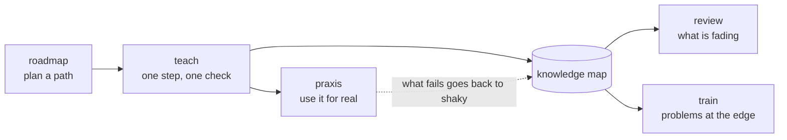

# Teaching

The method lives in Claude Code, not in the app: skills say how to teach, subagents check facts and draw, and the MCP tools are the only way the tutor reaches the learner. The app enforces nothing about pedagogy; it records and shows. So changing how Aristotle teaches is mostly editing Markdown in `.claude/`.

The idea behind it is Eero Alvar's "Bodybuilding for the Mind": struggle at the edge of what you can do is the training signal, and AI is the equipment that finds and loads that edge ([README](../README.md#the-method)).

## The loop

- **teach** probes what he knows, plans the map of what depends on what, then teaches one reasoning step per `show`, checking each with `quiz` or `ask` before moving on. It ends with `end_session` and a handoff.
- **review** practises concepts whose FSRS card says they are fading, by recall in writing, and records results with `record_practice`.
- **train** gives problems just above his level and moves the topic's training level as he solves them cleanly.
- **roadmap** plans an ordered path of topics with him (draft, then active), each step a topic.
- **praxis** designs a mission that puts a finished step to work in his own life, and reviews his debrief.

## Skills and subagents

<!-- generated: skills -->
| Kind | Name | What it is for |
|---|---|---|
| skill | [`praxis`](../.claude/skills/praxis/SKILL.md) | Praxis missions in Aristotle. |
| skill | [`review`](../.claude/skills/review/SKILL.md) | Spaced review in Aristotle. |
| skill | [`roadmap`](../.claude/skills/roadmap/SKILL.md) | Plan a roadmap with Diogo in Aristotle: an ordered path of topics towards something bigger, each with its own goal, agreed with him before any of it is taught. |
| skill | [`teach`](../.claude/skills/teach/SKILL.md) | Teach Diogo something in Aristotle so it is understood, not memorised. |
| skill | [`train`](../.claude/skills/train/SKILL.md) | Training sets in Aristotle. |
| agent | [`illustrator`](../.claude/agents/illustrator.md) | Draws a small, correct SVG diagram for one teaching step (optionally animated), checks it by rendering it in both themes, and returns the finished SVG. |
| agent | [`researcher`](../.claude/agents/researcher.md) | Fact-checks claims and scopes topics for the tutor. |
<!-- /generated -->

## Rules every skill keeps

These are in [`CLAUDE.md`](../CLAUDE.md) because they hold whichever skill is running:

- He reads and answers **in Aristotle, not the terminal**: teaching through `show`, graded checks through `quiz`, open questions through `ask`. Terminal replies are a line or two.
- **One reasoning step per `show`**, then a check.
- **The knowledge map stays true** (`update_map`): what is solid, what is shaky and why, what rests on what.
- If `quiz` or `ask` returns "No answer yet", end the turn; `collect_answers` when he is back.
- **Accuracy first**: verify any fact, name, date or formula before teaching it (the `researcher` subagent), and mark real uncertainty.

## Changing the method

- Edit the skill's `SKILL.md`. The `description` in its front matter decides when Claude picks it up, so keep it specific.
- If a skill needs something the tools cannot do, that is a new tool or a change to one ([extending.md](extending.md#add-an-mcp-tool)); the tool descriptions in [`server/mcp.ts`](../server/mcp.ts) are the other half of the method, since Claude reads them too.
- Try it in the dev instance with the `aristotle-dev` MCP server enabled, then `pnpm release`: lessons in the drawer run in the release copy and use the released skills.
