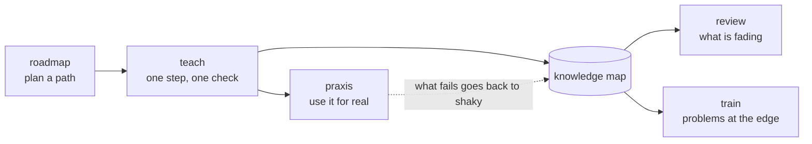

# Teaching

The method lives in Claude Code, not in the app: skills say how to teach, subagents check facts and draw, and the MCP tools are the only way the tutor reaches the learner. The app enforces nothing about pedagogy; it records and shows. So changing how Aristotle teaches is mostly editing Markdown in `.claude/`.

The idea behind it is Eero Alvar's "Bodybuilding for the Mind": struggle at the edge of what you can do is the training signal, and AI is the equipment that finds and loads that edge ([README](../README.md#the-method)).

## The loop

- **teach** probes what the learner knows, plans the map of what depends on what, then teaches one reasoning step per `show`, checking each with `quiz` or `ask` before moving on. It ends with `end_session` and a handoff.
- **review** practises concepts whose FSRS card says they are fading, by recall in writing, and records results with `record_practice`.
- **train** gives problems just above their level and moves the topic's training level as they solve them cleanly.
- **roadmap** plans an ordered path of topics with them (draft, then active), each step a topic.
- **praxis** designs a mission that puts a finished step to work in their own life, and reviews their debrief.

## Skills and subagents

<!-- generated: skills -->
| Kind | Name | What it is for |
|---|---|---|
| skill | [`praxis`](../.claude/skills/praxis/SKILL.md) | Praxis missions in Aristotle. |
| skill | [`review`](../.claude/skills/review/SKILL.md) | Spaced review in Aristotle. |
| skill | [`roadmap`](../.claude/skills/roadmap/SKILL.md) | Plan a roadmap with the learner in Aristotle: an ordered path of topics towards something bigger, each with its own goal, agreed with them before any of it is taught. |
| skill | [`teach`](../.claude/skills/teach/SKILL.md) | Teach the learner something in Aristotle so it is understood, not memorised. |
| skill | [`train`](../.claude/skills/train/SKILL.md) | Training sets in Aristotle. |
| agent | [`illustrator`](../.claude/agents/illustrator.md) | Draws a small, correct SVG diagram for one teaching step (optionally animated), checks it by rendering it in both themes, and returns the finished SVG. |
| agent | [`researcher`](../.claude/agents/researcher.md) | Fact-checks claims and scopes topics for the tutor. |
<!-- /generated -->

## Rules every skill keeps

These are in [`CLAUDE.md`](../CLAUDE.md) because they hold whichever skill is running:

- The learner reads and answers **in Aristotle, not the terminal**: teaching through `show`, graded checks through `quiz`, open questions through `ask`. Terminal replies are a line or two.
- **One reasoning step per `show`**, then a check.
- **The knowledge map stays true** (`update_map`): what is solid, what is shaky and why, what rests on what.
- **No stop button: a sitting closes itself.** If `quiz` or `ask` returns "No answer yet" (no answer within `ARISTOTLE_WAIT_MS`, 15 minutes), they have stepped away: in one message the map is brought up to date and `end_session` writes the handoff, and the turn ends. The question stays open; answering it brings Claude back to continue (`collect_answers` first).
- **Questions outlive their session.** One left unanswered stays answerable in the class page after the session ends. When they answer one that no tool call is waiting for, Aristotle tells Claude: "collect my answers" if its session is still going, otherwise it continues the topic (or the review or training). So `start_session` hands over any such answers itself, collecting them before it opens the new session (which would otherwise leave them in the old one); the skills need no separate `collect_answers` to start.
- **Every course ends with its final mission, on its own**: when the last class is done, `teach` hands to `praxis`, which designs and saves the capstone without proposing it first. Missions for single classes only when they ask. Planning a course asks where they will use it (`use`), and `read_about` (their About you page) comes before anything inferred, so missions fit anyone.
- **The chat beside a lesson is not the tutor**: a second Claude answers them while they read, with their screen as context, without moving the lesson or giving away a check's answer. `get_topic` shows the tutor what they said there.
- **What they wondered about reaches the tutor**: `get_topic` lists the phrases they glossed and the questions they asked on passages of the topic. Both are gaps they noticed themselves, worth a check or a step.
- **Hover cards are the tutor's to write** (a highlighted term carries its definition inside the highlight): `{{term|definition}}` and `[[concept-id]]` only exist where Claude puts them, so `show` answers a teaching step that has neither with a reminder to add them in the next steps.
- **Claude Code starts when Aristotle opens**, idle in the terminal drawer, so the first request never waits for it to boot; what is sent while it starts is typed in once it is ready.
- **Pictures for anything physical, spatial or timed** (in `teach`): an explorable first, then the visual kit, a real image as a `plate`, and an illustrator SVG last. A `flow` that moves real things draws them (`art`, `carries`, `makes`: glucose in, electrons along, ATP out), and their numbers are facts like any other.
- **Accuracy first**: verify any fact, name, date or formula before teaching it (the `researcher` subagent), and mark real uncertainty.
- **Fewer turns, sooner steps.** Each model turn costs the learner a second or more, while a tool call costs milliseconds, so the skills send calls that belong together in one message, in order: a step's `show` and then its `quiz` or `ask` (Claude Code runs a call as soon as its part of the message is written, so the step appears while the question is still being written); feedback's `show` and then the `update_map` or `record_practice` it implies; `get_topic` and `start_session` when continuing. Bookkeeping never takes a turn of its own.
- **In the drawer, the tutor runs as a lesson needs** ([`terminal.ts`](../server/terminal.ts)): `quiz` and `ask` are never moved to the background after two minutes (`CLAUDE_CODE_MCP_AUTO_BACKGROUND_MS=0`), the core tools are loaded up front instead of through tool search (the bridge tells the server it serves the drawer), and starting a new sitting from the interface clears the previous sitting's context first (unless one is in progress: open and active in the last 15 minutes). A review can be of everything fading, of one class (`/review <topic>`) or of one concept (`/review <topic>/<concept>`, from the concept's own page).

## Changing the method

- Edit the skill's `SKILL.md`. The `description` in its front matter decides when Claude picks it up, so keep it specific.
- If a skill needs something the tools cannot do, that is a new tool or a change to one ([extending.md](extending.md#add-an-mcp-tool)); the tool descriptions in [`server/mcp.ts`](../server/mcp.ts) are the other half of the method, since Claude reads them too.
- Try it in the dev instance with the `aristotle-dev` MCP server enabled, then `pnpm release`: lessons in the drawer run in the release copy and use the released skills.
